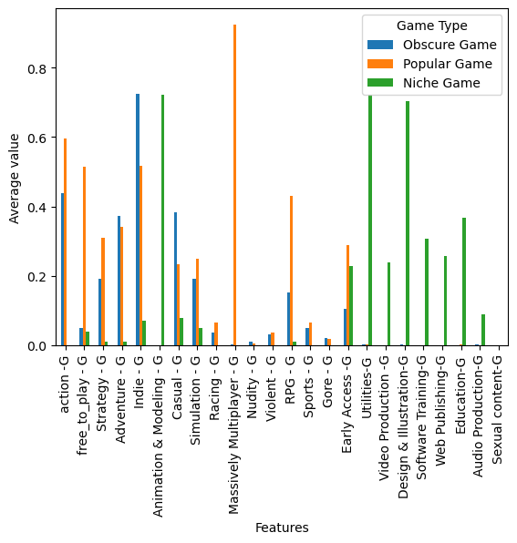

## Steam Games Clustering Analysis
### Author: Linh Nguyen

### Project Overview:
The objective of this project is to perform clustering analysis on a dataset containing information about various Steam games. The goal is to identify patterns and groupings among these games based on different features such as positive and negative ratings, price, and various game-specific attributes. The project involves using the KMeans clustering algorithm to categorize the games into distinct clusters.

### Dataset:
The dataset used in this project is a cleaned Steam game data file (cleaned_steam_game_data.csv). It contains information on a variety of games, including features such as appid, name, release date, developer, publisher, required age, achievements, positive and negative ratings, and more. The dataset encompasses a diverse set of attributes related to each game, allowing for a comprehensive analysis of the gaming landscape on the Steam platform.

### Methodology:
#### Cluster Analysis:

Explore and analyze the characteristics of each cluster.
Generate summary statistics for each cluster, including mean values and counts.
#### Visualization:

Visualize the distribution of games across clusters using bar charts.
Explore specific features of interest for each cluster, such as owners, positive/negative ratings, and price.
### Significance of the Project:
- Market Segmentation: Understanding clusters can help in market segmentation, allowing game developers and publishers to tailor their strategies for different player preferences.

- Game Profiling: Clustering enables the identification of distinct types of games based on user interactions, providing valuable insights for game developers and marketers.

- User Recommendations: Clustering analysis can aid in recommending games to users based on their preferences, potentially improving user experience and engagement on the Steam platform.

- Decision Support: The results of this analysis can inform strategic decisions related to game development, marketing, and sales, providing a data-driven approach to decision-making.

## Dataset Loading


```python
import pandas as pd
from sklearn.cluster import KMeans
from sklearn.preprocessing import StandardScaler
import matplotlib.pyplot as plt
```


```python
data = pd.read_csv('cleaned_steam_game_data.csv')
data.head()
```


<div>
<style scoped>
    .dataframe tbody tr th:only-of-type {
        vertical-align: middle;
    }

    .dataframe tbody tr th {
        vertical-align: top;
    }

    .dataframe thead th {
        text-align: right;
    }
</style>
<table border="1" class="dataframe">
  <thead>
    <tr style="text-align: right;">
      <th></th>
      <th>appid</th>
      <th>name</th>
      <th>release_date</th>
      <th>english</th>
      <th>developer</th>
      <th>publisher</th>
      <th>required_age</th>
      <th>achievements</th>
      <th>positive_ratings</th>
      <th>negative_ratings</th>
      <th>...</th>
      <th>Local Multi-player-C</th>
      <th>Single-player-C</th>
      <th>MMO-C</th>
      <th>Captions available-C</th>
      <th>Linux</th>
      <th>Windows</th>
      <th>Mac</th>
      <th>day</th>
      <th>month</th>
      <th>year</th>
    </tr>
  </thead>
  <tbody>
    <tr>
      <th>0</th>
      <td>10</td>
      <td>Counter-Strike</td>
      <td>01-11-2000</td>
      <td>1</td>
      <td>Valve</td>
      <td>Valve</td>
      <td>0</td>
      <td>0</td>
      <td>124534</td>
      <td>3339</td>
      <td>...</td>
      <td>0</td>
      <td>0</td>
      <td>0</td>
      <td>0</td>
      <td>1</td>
      <td>1</td>
      <td>1</td>
      <td>1</td>
      <td>11</td>
      <td>2000</td>
    </tr>
    <tr>
      <th>1</th>
      <td>20</td>
      <td>Team Fortress Classic</td>
      <td>01-04-1999</td>
      <td>1</td>
      <td>Valve</td>
      <td>Valve</td>
      <td>0</td>
      <td>0</td>
      <td>3318</td>
      <td>633</td>
      <td>...</td>
      <td>0</td>
      <td>0</td>
      <td>0</td>
      <td>0</td>
      <td>1</td>
      <td>1</td>
      <td>1</td>
      <td>1</td>
      <td>4</td>
      <td>1999</td>
    </tr>
    <tr>
      <th>2</th>
      <td>30</td>
      <td>Day of Defeat</td>
      <td>01-05-2003</td>
      <td>1</td>
      <td>Valve</td>
      <td>Valve</td>
      <td>0</td>
      <td>0</td>
      <td>3416</td>
      <td>398</td>
      <td>...</td>
      <td>0</td>
      <td>0</td>
      <td>0</td>
      <td>0</td>
      <td>1</td>
      <td>1</td>
      <td>1</td>
      <td>1</td>
      <td>5</td>
      <td>2003</td>
    </tr>
    <tr>
      <th>3</th>
      <td>40</td>
      <td>Deathmatch Classic</td>
      <td>01-06-2001</td>
      <td>1</td>
      <td>Valve</td>
      <td>Valve</td>
      <td>0</td>
      <td>0</td>
      <td>1273</td>
      <td>267</td>
      <td>...</td>
      <td>0</td>
      <td>0</td>
      <td>0</td>
      <td>0</td>
      <td>1</td>
      <td>1</td>
      <td>1</td>
      <td>1</td>
      <td>6</td>
      <td>2001</td>
    </tr>
    <tr>
      <th>4</th>
      <td>50</td>
      <td>Half-Life: Opposing Force</td>
      <td>01-11-1999</td>
      <td>1</td>
      <td>Gearbox Software</td>
      <td>Valve</td>
      <td>0</td>
      <td>0</td>
      <td>5250</td>
      <td>288</td>
      <td>...</td>
      <td>0</td>
      <td>1</td>
      <td>0</td>
      <td>0</td>
      <td>1</td>
      <td>1</td>
      <td>1</td>
      <td>1</td>
      <td>11</td>
      <td>1999</td>
    </tr>
  </tbody>
</table>
<p>5 rows × 70 columns</p>
</div>


## Data Preprocessing & Choosing Optimal Number of Clusters


```python
X = data.drop(['name','release_date','developer','publisher','tag1', 'tag2', 'tag3','day'], axis=1)

scaler = StandardScaler()
X_std = scaler.fit_transform(X)
```


```python
from sklearn.cluster import KMeans
from sklearn.metrics import silhouette_score
import matplotlib.pyplot as plt

fig, ax = plt.subplots(figsize=(10, 5))

distortions = []
for i in range(1, 11):
    kmeans = KMeans(n_clusters=i, random_state=0)
    kmeans.fit(X_std)
    distortions.append(kmeans.inertia_)
ax.plot(range(1, 11), distortions, marker='o', label='Distortion')
ax.set_xlabel('Number of clusters')

silhouette_scores = []
for i in range(2, 11):
    kmeans = KMeans(n_clusters=i, random_state=0)
    kmeans.fit(X_std)
    score = silhouette_score(X_std, kmeans.labels_)
    silhouette_scores.append(score)
ax2 = ax.twinx()
ax2.plot(range(2, 11), silhouette_scores, marker='o', color='orange', label='Silhouette score')
ax2.set_ylabel('Silhouette score')

ax.legend(loc='upper left')
ax2.legend(loc='upper right')
plt.show()

```

    /Users/linhnguyen/anaconda3/lib/python3.11/site-packages/sklearn/cluster/_kmeans.py:1412: FutureWarning: The default value of `n_init` will change from 10 to 'auto' in 1.4. Set the value of `n_init` explicitly to suppress the warning
      super()._check_params_vs_input(X, default_n_init=10)
    /Users/linhnguyen/anaconda3/lib/python3.11/site-packages/sklearn/cluster/_kmeans.py:1412: FutureWarning: The default value of `n_init` will change from 10 to 'auto' in 1.4. Set the value of `n_init` explicitly to suppress the warning
      super()._check_params_vs_input(X, default_n_init=10)
    /Users/linhnguyen/anaconda3/lib/python3.11/site-packages/sklearn/cluster/_kmeans.py:1412: FutureWarning: The default value of `n_init` will change from 10 to 'auto' in 1.4. Set the value of `n_init` explicitly to suppress the warning
      super()._check_params_vs_input(X, default_n_init=10)
    /Users/linhnguyen/anaconda3/lib/python3.11/site-packages/sklearn/cluster/_kmeans.py:1412: FutureWarning: The default value of `n_init` will change from 10 to 'auto' in 1.4. Set the value of `n_init` explicitly to suppress the warning
      super()._check_params_vs_input(X, default_n_init=10)
    /Users/linhnguyen/anaconda3/lib/python3.11/site-packages/sklearn/cluster/_kmeans.py:1412: FutureWarning: The default value of `n_init` will change from 10 to 'auto' in 1.4. Set the value of `n_init` explicitly to suppress the warning
      super()._check_params_vs_input(X, default_n_init=10)
    /Users/linhnguyen/anaconda3/lib/python3.11/site-packages/sklearn/cluster/_kmeans.py:1412: FutureWarning: The default value of `n_init` will change from 10 to 'auto' in 1.4. Set the value of `n_init` explicitly to suppress the warning
      super()._check_params_vs_input(X, default_n_init=10)
    /Users/linhnguyen/anaconda3/lib/python3.11/site-packages/sklearn/cluster/_kmeans.py:1412: FutureWarning: The default value of `n_init` will change from 10 to 'auto' in 1.4. Set the value of `n_init` explicitly to suppress the warning
      super()._check_params_vs_input(X, default_n_init=10)
    /Users/linhnguyen/anaconda3/lib/python3.11/site-packages/sklearn/cluster/_kmeans.py:1412: FutureWarning: The default value of `n_init` will change from 10 to 'auto' in 1.4. Set the value of `n_init` explicitly to suppress the warning
      super()._check_params_vs_input(X, default_n_init=10)
    /Users/linhnguyen/anaconda3/lib/python3.11/site-packages/sklearn/cluster/_kmeans.py:1412: FutureWarning: The default value of `n_init` will change from 10 to 'auto' in 1.4. Set the value of `n_init` explicitly to suppress the warning
      super()._check_params_vs_input(X, default_n_init=10)
    /Users/linhnguyen/anaconda3/lib/python3.11/site-packages/sklearn/cluster/_kmeans.py:1412: FutureWarning: The default value of `n_init` will change from 10 to 'auto' in 1.4. Set the value of `n_init` explicitly to suppress the warning
      super()._check_params_vs_input(X, default_n_init=10)
    /Users/linhnguyen/anaconda3/lib/python3.11/site-packages/sklearn/cluster/_kmeans.py:1412: FutureWarning: The default value of `n_init` will change from 10 to 'auto' in 1.4. Set the value of `n_init` explicitly to suppress the warning
      super()._check_params_vs_input(X, default_n_init=10)
    /Users/linhnguyen/anaconda3/lib/python3.11/site-packages/sklearn/cluster/_kmeans.py:1412: FutureWarning: The default value of `n_init` will change from 10 to 'auto' in 1.4. Set the value of `n_init` explicitly to suppress the warning
      super()._check_params_vs_input(X, default_n_init=10)
    /Users/linhnguyen/anaconda3/lib/python3.11/site-packages/sklearn/cluster/_kmeans.py:1412: FutureWarning: The default value of `n_init` will change from 10 to 'auto' in 1.4. Set the value of `n_init` explicitly to suppress the warning
      super()._check_params_vs_input(X, default_n_init=10)
    /Users/linhnguyen/anaconda3/lib/python3.11/site-packages/sklearn/cluster/_kmeans.py:1412: FutureWarning: The default value of `n_init` will change from 10 to 'auto' in 1.4. Set the value of `n_init` explicitly to suppress the warning
      super()._check_params_vs_input(X, default_n_init=10)
    /Users/linhnguyen/anaconda3/lib/python3.11/site-packages/sklearn/cluster/_kmeans.py:1412: FutureWarning: The default value of `n_init` will change from 10 to 'auto' in 1.4. Set the value of `n_init` explicitly to suppress the warning
      super()._check_params_vs_input(X, default_n_init=10)
    /Users/linhnguyen/anaconda3/lib/python3.11/site-packages/sklearn/cluster/_kmeans.py:1412: FutureWarning: The default value of `n_init` will change from 10 to 'auto' in 1.4. Set the value of `n_init` explicitly to suppress the warning
      super()._check_params_vs_input(X, default_n_init=10)
    /Users/linhnguyen/anaconda3/lib/python3.11/site-packages/sklearn/cluster/_kmeans.py:1412: FutureWarning: The default value of `n_init` will change from 10 to 'auto' in 1.4. Set the value of `n_init` explicitly to suppress the warning
      super()._check_params_vs_input(X, default_n_init=10)
    /Users/linhnguyen/anaconda3/lib/python3.11/site-packages/sklearn/cluster/_kmeans.py:1412: FutureWarning: The default value of `n_init` will change from 10 to 'auto' in 1.4. Set the value of `n_init` explicitly to suppress the warning
      super()._check_params_vs_input(X, default_n_init=10)
    /Users/linhnguyen/anaconda3/lib/python3.11/site-packages/sklearn/cluster/_kmeans.py:1412: FutureWarning: The default value of `n_init` will change from 10 to 'auto' in 1.4. Set the value of `n_init` explicitly to suppress the warning
      super()._check_params_vs_input(X, default_n_init=10)


    

    


## Clustering


```python
kmeans = KMeans(n_clusters=3, random_state=0)
kmeans.fit(X_std)

cluster_labels = kmeans.labels_

cluster_df = pd.DataFrame(X)
cluster_df['cluster'] = kmeans.labels_
cluster_summary = cluster_df.groupby('cluster').agg('mean')

# Add a column for the number of observations in each cluster
cluster_summary['count'] = cluster_df['cluster'].value_counts()

print(cluster_summary)

cluster_counts = cluster_summary['count']

plt.bar(cluster_counts.index, cluster_counts)

plt.xlabel('Cluster')
plt.ylabel('Number of observations')
plt.xticks(cluster_counts.index)
plt.show()
```

    /Users/linhnguyen/anaconda3/lib/python3.11/site-packages/sklearn/cluster/_kmeans.py:1412: FutureWarning: The default value of `n_init` will change from 10 to 'auto' in 1.4. Set the value of `n_init` explicitly to suppress the warning
      super()._check_params_vs_input(X, default_n_init=10)


                     appid   english  required_age  achievements  \
    cluster                                                        
    0        596405.228086  0.981660      0.350936     45.962367   
    1        590534.765730  0.961178      0.542169     26.021419   
    2        585748.613861  0.990099      0.000000      2.178218   
    
             positive_ratings  negative_ratings  average_playtime  \
    cluster                                                         
    0              714.299996        129.647996        113.886529   
    1            11057.717537       3087.775100       1419.453815   
    2              951.099010         66.475248         86.485149   
    
             median_playtime        owners      price  ...  Local Multi-player-C  \
    cluster                                            ...                         
    0             110.554924  1.041741e+05   6.061492  ...                   0.0   
    1            1401.697456  1.184431e+06   4.236118  ...                   0.0   
    2              77.970297  1.342079e+05  24.039109  ...                   0.0   
    
             Single-player-C     MMO-C  Captions available-C     Linux   Windows  \
    cluster                                                                        
    0               0.966828  0.000000                   0.0  0.194914  0.999809   
    1               0.396252  0.562249                   0.0  0.149933  1.000000   
    2               0.247525  0.009901                   0.0  0.108911  1.000000   
    
                  Mac     month         year  count  
    cluster                                          
    0        0.299501  6.547947  2016.489953  26227  
    1        0.258367  6.753681  2016.787149    747  
    2        0.178218  7.039604  2016.475248    101  
    
    [3 rows x 63 columns]


    

    


## Clustering Ananalysis & Visualization

### Give labels to each cluster: 'Obscure Game', 'Popular Game', and 'Niche Game'


```python
cluster_summary_T = cluster_summary.T

cluster_summary_T = cluster_summary_T.drop('count')

features_of_interest = ['owners']
cluster_summary_filtered = cluster_summary[features_of_interest]

cluster_summary_filtered_T = cluster_summary_filtered.T
cluster_summary_filtered_T = cluster_summary_filtered_T.rename_axis('')


cluster_summary_filtered_T.plot(kind='bar')

plt.xlabel('Features')
plt.ylabel('Average value')
legend_labels = ['Obscure Game', 'Popular Game', 'Niche Game']
plt.legend(legend_labels, title="Game Type")

plt.show()
```


    

    


```python
features_of_interest2 = ['positive_ratings','negative_ratings']
cluster_summary_filtered2 = cluster_summary[features_of_interest2]

cluster_summary_filtered_T2 = cluster_summary_filtered2.T

cluster_summary_filtered_T2.plot(kind='bar')

plt.xlabel('Features')
plt.ylabel('Average value')
legend_labels = ['Obscure Game', 'Popular Game', 'Niche Game']
plt.legend(legend_labels, title="Game Type")

plt.show()
```


    

    


```python
features_of_interest3 = ['price']
cluster_summary_filtered3 = cluster_summary[features_of_interest3]

cluster_summary_filtered_T3 = cluster_summary_filtered3.T

cluster_summary_filtered_T3.plot(kind='bar')

plt.xlabel('Features')
plt.ylabel('Average value')

legend_labels = ['Obscure Game', 'Popular Game', 'Niche Game']
plt.legend(legend_labels, title="Game Type")

plt.show()
```


    

    


```python
features_of_interest4 = ['positive_ratings']
cluster_summary_filtered4 = cluster_summary[features_of_interest4]

cluster_summary_filtered_T4 = cluster_summary_filtered4.T

cluster_summary_filtered_T4.plot(kind='bar')

plt.xlabel('Features')
plt.ylabel('Average value')
legend_labels = ['Obscure Game', 'Popular Game', 'Niche Game']
plt.legend(legend_labels, title="Game Type")
plt.show()
```


    

    


```python
cluster_summary_filtered6 = cluster_summary.iloc[:,10:34]

cluster_summary_filtered_T6 = cluster_summary_filtered6.T

cluster_summary_filtered_T6.plot(kind='bar')

plt.xlabel('Features')
plt.ylabel('Average value')
legend_labels = ['Obscure Game', 'Popular Game', 'Niche Game']
plt.legend(legend_labels, title="Game Type")
```


    <matplotlib.legend.Legend at 0x150d833d0>


    

    


```python
cluster_summary_filtered7 = cluster_summary.iloc[:,35:57]

cluster_summary_filtered_T7 = cluster_summary_filtered7.T

cluster_summary_filtered_T7.plot(kind='bar')

# Add labels for the x and y axes
plt.xlabel('Features')
plt.ylabel('Average value')
legend_labels = ['Obscure Game', 'Popular Game', 'Niche Game']
plt.legend(legend_labels, title="Game Type")

plt.show()
```


    

    

